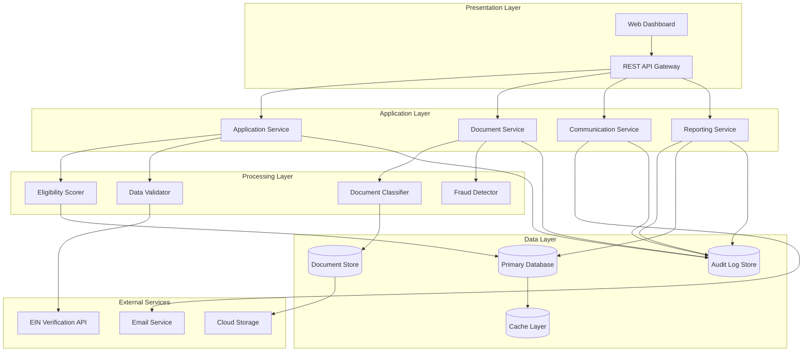

# Design Document: Government Lending CRM Platform

## Overview

The Government Lending CRM Platform is a multi-tier system that automates micro-business grant and loan application processing while maintaining human oversight. The architecture follows a modular design with clear separation between document processing, business logic, data storage, and presentation layers. The system prioritizes auditability, privacy, and accuracy through comprehensive logging, encryption, and validation mechanisms.

## Architecture

### High-Level Architecture



### Technology Stack

- **Backend**: Node.js with TypeScript for type safety and maintainability
- **API Framework**: Express.js with OpenAPI/Swagger documentation
- **Database**: PostgreSQL for relational data with JSONB support for flexible document storage
- **Document Store**: AWS S3 or Azure Blob Storage for encrypted file storage
- **Cache**: Redis for session management and performance optimization
- **ML/Classification**: Python microservice using scikit-learn or TensorFlow for document classification
- **Message Queue**: RabbitMQ or AWS SQS for asynchronous processing
- **Authentication**: OAuth 2.0 with role-based access control (RBAC)
- **Encryption**: AES-256 for data at rest, TLS 1.3 for data in transit

## Components and Interfaces

### 1. Document Service

**Responsibility**: Handle document upload, classification, and extraction

**Key Interfaces**:

```typescript
interface DocumentService {
  uploadDocument(file: File, applicationId: string): Promise<DocumentMetadata>;
  classifyDocument(documentId: string): Promise<ClassificationResult>;
  extractData(documentId: string): Promise<ExtractedData>;
  validateDocument(documentId: string): Promise<ValidationResult>;
}

interface ClassificationResult {
  documentType: 'W9' | 'EIN' | 'BANK_STATEMENT' | 'OTHER';
  confidenceScore: number; // 0-100
  requiresManualReview: boolean;
  timestamp: Date;
}

interface ExtractedData {
  documentId: string;
  fields: Record<string, any>;
  confidenceScores: Record<string, number>;
  rawText?: string;
}
```

**Implementation Details**:
- Use multipart/form-data for file uploads with size limits (10MB per file)
- Store original files in encrypted cloud storage with unique identifiers
- Invoke ML classification service via REST API or message queue
- Cache classification results in Redis for 24 hours
- Generate thumbnails for PDF documents for quick preview

### 2. Application Service

**Responsibility**: Manage application lifecycle, eligibility scoring, and workflow orchestration

**Key Interfaces**:

```typescript
interface ApplicationService {
  createApplication(data: ApplicationData): Promise<Application>;
  updateApplication(id: string, data: Partial<ApplicationData>): Promise<Application>;
  getApplication(id: string): Promise<Application>;
  calculateEligibility(id: string): Promise<EligibilityResult>;
  submitForReview(id: string): Promise<void>;
  makeDecision(id: string, decision: Decision): Promise<void>;
}

interface Application {
  id: string;
  applicantInfo: ApplicantInfo;
  documents: DocumentMetadata[];
  status: ApplicationStatus;
  eligibilityScore: number | null;
  missingDocuments: string[];
  createdAt: Date;
  updatedAt: Date;
}

interface EligibilityResult {
  score: number;
  passed: boolean;
  reasons: string[];
  programRulesApplied: string[];
  confidenceScore: number;
}

type ApplicationStatus = 
  | 'DRAFT' 
  | 'SUBMITTED' 
  | 'UNDER_REVIEW' 
  | 'PENDING_DOCUMENTS' 
  | 'APPROVED' 
  | 'REJECTED';
```

**Implementation Details**:
- Use state machine pattern for application status transitions
- Implement eligibility scoring as a rules engine with configurable program rules
- Store program rules in database as JSON with versioning
- Trigger document validation and classification asynchronously on submission
- Emit events for status changes to trigger communication service

### 3. Data Validator

**Responsibility**: Verify applicant data against external sources and detect anomalies

**Key Interfaces**:

```typescript
interface DataValidator {
  verifyEIN(ein: string, businessName: string): Promise<VerificationResult>;
  validateContactInfo(contact: ContactInfo): Promise<ValidationResult>;
  detectFraud(application: Application): Promise<FraudAnalysis>;
}

interface VerificationResult {
  isValid: boolean;
  source: string;
  matchConfidence: number;
  details: Record<string, any>;
  timestamp: Date;
}

interface FraudAnalysis {
  riskScore: number; // 0-100, higher = more suspicious
  flags: FraudFlag[];
  requiresInvestigation: boolean;
}

interface FraudFlag {
  type: 'DUPLICATE_EIN' | 'SUSPICIOUS_DOCUMENT' | 'DATA_MISMATCH' | 'PATTERN_ANOMALY';
  severity: 'LOW' | 'MEDIUM' | 'HIGH';
  description: string;
  evidence: any;
}
```

**Implementation Details**:
- Integrate with IRS EIN verification API or third-party services
- Implement rate limiting and caching for external API calls
- Use pattern matching and historical data analysis for fraud detection
- Store verification results with timestamps for audit trail
- Implement retry logic with exponential backoff for external service failures

### 4. Communication Service

**Responsibility**: Generate and send notifications to applicants and staff

**Key Interfaces**:

```typescript
interface CommunicationService {
  sendApplicantNotification(applicationId: string, event: ApplicationEvent): Promise<void>;
  generateStaffSummary(applicationId: string): Promise<StaffSummary>;
  sendEmail(recipient: string, template: string, data: any): Promise<void>;
  logCommunication(communication: Communication): Promise<void>;
}

interface StaffSummary {
  applicationId: string;
  applicantName: string;
  programType: string;
  eligibilityScore: number;
  missingDocuments: string[];
  fraudFlags: FraudFlag[];
  recommendedAction: 'APPROVE' | 'REJECT' | 'REQUEST_INFO';
  reasoning: string[];
}

interface Communication {
  id: string;
  applicationId: string;
  recipient: string;
  type: 'EMAIL' | 'SMS' | 'PORTAL_MESSAGE';
  template: string;
  sentAt: Date;
  status: 'SENT' | 'FAILED' | 'PENDING';
}
```

**Implementation Details**:
- Use template engine (Handlebars or EJS) for email generation
- Store email templates in database for easy updates without deployment
- Implement message queue for asynchronous email sending
- Support multiple languages for applicant communications
- Track email delivery status and bounce handling
- Generate plain-text and HTML versions of all emails

### 5. Reporting Service

**Responsibility**: Generate dashboards, compliance reports, and exports

**Key Interfaces**:

```typescript
interface ReportingService {
  getDashboardMetrics(filters: DashboardFilters): Promise<DashboardData>;
  generateEligibilityReport(filters: ReportFilters): Promise<EligibilityReport>;
  generateMissingDocumentsCSV(filters: ReportFilters): Promise<string>;
  generateComplianceSummary(filters: ReportFilters): Promise<string>;
  exportApplicationData(applicationIds: string[]): Promise<ExportData>;
}

interface DashboardData {
  totalApplications: number;
  approvalRate: number;
  averageProcessingTime: number; // in hours
  documentClassificationAccuracy: number;
  applicationsByStatus: Record<ApplicationStatus, number>;
  trendsOverTime: TimeSeriesData[];
}

interface EligibilityReport {
  applications: Array<{
    id: string;
    applicantName: string;
    eligibilityScore: number;
    decision: string;
    decidedBy: string;
    decidedAt: Date;
    programRules: string[];
  }>;
  metadata: {
    generatedAt: Date;
    filters: ReportFilters;
    totalCount: number;
  };
}
```

**Implementation Details**:
- Use materialized views in PostgreSQL for fast dashboard queries
- Implement caching for frequently accessed dashboard data (5-minute TTL)
- Generate CSV exports using streaming to handle large datasets
- Format compliance summaries as Markdown with embedded tables
- Support date range filtering, program type filtering, and status filtering
- Schedule automated report generation for monthly compliance exports

### 6. Audit Log Service

**Responsibility**: Record all automated actions with timestamps and confidence scores

**Key Interfaces**:

```typescript
interface AuditLogService {
  logAction(action: AuditAction): Promise<void>;
  queryLogs(filters: LogFilters): Promise<AuditLog[]>;
  detectPrivacyBreach(): Promise<BreachAlert[]>;
}

interface AuditAction {
  actionType: string;
  entityType: 'APPLICATION' | 'DOCUMENT' | 'USER' | 'SYSTEM';
  entityId: string;
  performedBy: string; // user ID or 'SYSTEM'
  confidenceScore?: number;
  details: Record<string, any>;
  timestamp: Date;
}

interface AuditLog extends AuditAction {
  id: string;
  ipAddress?: string;
  userAgent?: string;
}
```

**Implementation Details**:
- Use append-only log storage with write-ahead logging
- Implement log rotation and archival to cold storage after 90 days
- Index logs by timestamp, entity ID, and action type for fast queries
- Encrypt sensitive data in log entries
- Implement anomaly detection for unusual access patterns
- Retain logs for 7 years in compliance with regulatory requirements

## Data Models

### Core Entities

```typescript
// Applicant
interface Applicant {
  id: string;
  businessName: string;
  ein: string;
  contactInfo: {
    email: string;
    phone: string;
    address: Address;
  };
  ownerInfo: {
    firstName: string;
    lastName: string;
    ssn: string; // encrypted
  };
  createdAt: Date;
  updatedAt: Date;
}

// Application
interface Application {
  id: string;
  applicantId: string;
  programType: string;
  requestedAmount: number;
  status: ApplicationStatus;
  eligibilityScore: number | null;
  documents: string[]; // document IDs
  missingDocuments: string[];
  fraudFlags: FraudFlag[];
  assignedTo: string | null; // staff member ID
  submittedAt: Date | null;
  reviewedAt: Date | null;
  decidedAt: Date | null;
  decision: Decision | null;
  createdAt: Date;
  updatedAt: Date;
}

// Document
interface Document {
  id: string;
  applicationId: string;
  fileName: string;
  fileSize: number;
  mimeType: string;
  storageUrl: string; // encrypted S3/Blob URL
  documentType: string;
  classificationConfidence: number;
  extractedData: Record<string, any>;
  uploadedAt: Date;
  classifiedAt: Date | null;
}

// Program Rules
interface ProgramRule {
  id: string;
  programType: string;
  version: number;
  rules: {
    minCreditScore?: number;
    maxLoanAmount?: number;
    requiredDocuments: string[];
    eligibilityCriteria: Criterion[];
  };
  activeFrom: Date;
  activeTo: Date | null;
}

// Decision
interface Decision {
  applicationId: string;
  decidedBy: string; // staff member ID
  decision: 'APPROVED' | 'REJECTED' | 'DEFERRED';
  amount: number | null;
  justification: string;
  overrideReason: string | null;
  decidedAt: Date;
}
```

### Database Schema

```sql
-- Applications table
CREATE TABLE applications (
  id UUID PRIMARY KEY DEFAULT gen_random_uuid(),
  applicant_id UUID NOT NULL REFERENCES applicants(id),
  program_type VARCHAR(100) NOT NULL,
  requested_amount DECIMAL(12, 2) NOT NULL,
  status VARCHAR(50) NOT NULL,
  eligibility_score DECIMAL(5, 2),
  missing_documents JSONB DEFAULT '[]',
  fraud_flags JSONB DEFAULT '[]',
  assigned_to UUID REFERENCES staff_members(id),
  submitted_at TIMESTAMP,
  reviewed_at TIMESTAMP,
  decided_at TIMESTAMP,
  decision JSONB,
  created_at TIMESTAMP DEFAULT NOW(),
  updated_at TIMESTAMP DEFAULT NOW()
);

-- Documents table
CREATE TABLE documents (
  id UUID PRIMARY KEY DEFAULT gen_random_uuid(),
  application_id UUID NOT NULL REFERENCES applications(id),
  file_name VARCHAR(255) NOT NULL,
  file_size INTEGER NOT NULL,
  mime_type VARCHAR(100) NOT NULL,
  storage_url TEXT NOT NULL, -- encrypted
  document_type VARCHAR(50),
  classification_confidence DECIMAL(5, 2),
  extracted_data JSONB,
  uploaded_at TIMESTAMP DEFAULT NOW(),
  classified_at TIMESTAMP
);

-- Audit logs table
CREATE TABLE audit_logs (
  id UUID PRIMARY KEY DEFAULT gen_random_uuid(),
  action_type VARCHAR(100) NOT NULL,
  entity_type VARCHAR(50) NOT NULL,
  entity_id UUID NOT NULL,
  performed_by VARCHAR(100) NOT NULL,
  confidence_score DECIMAL(5, 2),
  details JSONB,
  ip_address INET,
  user_agent TEXT,
  timestamp TIMESTAMP DEFAULT NOW()
);

-- Indexes for performance
CREATE INDEX idx_applications_status ON applications(status);
CREATE INDEX idx_applications_submitted_at ON applications(submitted_at);
CREATE INDEX idx_documents_application_id ON documents(application_id);
CREATE INDEX idx_audit_logs_timestamp ON audit_logs(timestamp);
CREATE INDEX idx_audit_logs_entity ON audit_logs(entity_type, entity_id);
```

## Error Handling

### Error Categories

1. **Validation Errors** (400): Invalid input data, missing required fields
2. **Authentication Errors** (401): Invalid credentials, expired tokens
3. **Authorization Errors** (403): Insufficient permissions for action
4. **Not Found Errors** (404): Resource does not exist
5. **Conflict Errors** (409): State conflict (e.g., application already submitted)
6. **External Service Errors** (502): Third-party API failures
7. **System Errors** (500): Unexpected internal errors

### Error Response Format

```typescript
interface ErrorResponse {
  error: {
    code: string;
    message: string;
    details?: any;
    timestamp: Date;
    requestId: string;
  };
}
```

### Error Handling Strategy

- **Retry Logic**: Implement exponential backoff for transient external service failures (max 3 retries)
- **Circuit Breaker**: Prevent cascading failures when external services are down
- **Graceful Degradation**: Continue processing with reduced functionality when non-critical services fail
- **Error Logging**: Log all errors with full context to audit log and monitoring system
- **User-Friendly Messages**: Translate technical errors into clear, actionable messages for users
- **Alerting**: Send alerts to administrators for critical errors (privacy breaches, system failures)

### Specific Error Scenarios

- **Document Classification Failure**: Flag document for manual review, notify staff
- **EIN Verification Timeout**: Cache partial results, retry in background, allow manual override
- **Email Delivery Failure**: Queue for retry, log failure, display in-app notification as fallback
- **Database Connection Loss**: Use connection pooling with automatic reconnection, fail fast for writes
- **Storage Service Unavailable**: Queue uploads for retry, provide user feedback on delay

## Testing Strategy

### Unit Testing

- **Coverage Target**: 80% code coverage for business logic
- **Framework**: Jest for TypeScript/Node.js, pytest for Python ML service
- **Focus Areas**:
  - Eligibility scoring logic with various program rules
  - Document classification confidence calculations
  - Fraud detection pattern matching
  - Data validation functions
  - Template rendering for communications

### Integration Testing

- **Framework**: Supertest for API testing, Testcontainers for database
- **Test Scenarios**:
  - End-to-end application submission workflow
  - Document upload, classification, and extraction pipeline
  - External API integration (EIN verification with mocked responses)
  - Email sending and communication logging
  - Report generation with various filters

### Performance Testing

- **Tool**: Apache JMeter or k6
- **Metrics**:
  - API response time < 500ms for 95th percentile
  - Document classification time < 5 seconds per document
  - Dashboard load time < 2 seconds
  - Support 100 concurrent users
  - Handle 1000 applications per day

### Security Testing

- **Penetration Testing**: Annual third-party security audit
- **Vulnerability Scanning**: Automated scanning with OWASP ZAP
- **Test Cases**:
  - SQL injection prevention
  - XSS attack prevention
  - Authentication bypass attempts
  - Unauthorized data access attempts
  - Encryption verification for PII

### Acceptance Testing

- **Criteria**:
  - Document classification accuracy ≥ 95% on test dataset
  - Average review time reduction ≥ 40% compared to baseline
  - Zero privacy breaches in production environment
  - All compliance reports generate successfully
  - Staff members can override automated decisions

### Test Data Management

- **Synthetic Data**: Generate realistic test applications with faker.js
- **Anonymized Production Data**: Use anonymized subset for performance testing
- **Document Samples**: Maintain library of sample W-9, EIN, and bank statement documents
- **Edge Cases**: Test with corrupted files, unusual formats, missing data

## Deployment and Operations

### Deployment Architecture

- **Environment**: Cloud-native deployment on AWS or Azure
- **Containerization**: Docker containers orchestrated with Kubernetes
- **CI/CD**: GitHub Actions or GitLab CI for automated testing and deployment
- **Blue-Green Deployment**: Zero-downtime deployments with traffic switching
- **Database Migrations**: Automated with Flyway or Liquibase

### Monitoring and Observability

- **Application Monitoring**: New Relic or Datadog for performance metrics
- **Log Aggregation**: ELK Stack (Elasticsearch, Logstash, Kibana) or CloudWatch
- **Alerting**: PagerDuty for critical alerts
- **Metrics to Track**:
  - Document classification accuracy (daily)
  - Average application processing time
  - API error rates and response times
  - External service availability
  - Privacy breach detection alerts

### Backup and Disaster Recovery

- **Database Backups**: Automated daily backups with 30-day retention
- **Document Storage**: Cross-region replication for uploaded files
- **Recovery Time Objective (RTO)**: 4 hours
- **Recovery Point Objective (RPO)**: 1 hour
- **Disaster Recovery Testing**: Quarterly DR drills

## Security Considerations

### Data Protection

- **Encryption at Rest**: AES-256 for database and file storage
- **Encryption in Transit**: TLS 1.3 for all API communications
- **PII Handling**: Tokenization for SSN, encryption for sensitive fields
- **Key Management**: AWS KMS or Azure Key Vault for encryption key rotation

### Access Control

- **Authentication**: OAuth 2.0 with multi-factor authentication for staff
- **Authorization**: Role-based access control (RBAC) with principle of least privilege
- **Roles**:
  - **Applicant**: View own applications, upload documents
  - **Reviewer**: View assigned applications, request additional info
  - **Approver**: Make final funding decisions
  - **Administrator**: System configuration, user management
  - **Auditor**: Read-only access to all data and logs

### Compliance

- **Regulations**: SOC 2, GDPR (if applicable), SBA lending regulations
- **Audit Trail**: Immutable logs of all data access and modifications
- **Data Retention**: 7-year retention for audit logs and application data
- **Right to Erasure**: Implement data deletion workflow for applicant requests
- **Privacy Impact Assessment**: Annual review of data handling practices

## Scalability Considerations

- **Horizontal Scaling**: Stateless API servers behind load balancer
- **Database Scaling**: Read replicas for reporting queries, connection pooling
- **Caching Strategy**: Redis for session data, classification results, dashboard metrics
- **Asynchronous Processing**: Message queues for document processing, email sending
- **CDN**: CloudFront or Azure CDN for static assets and document thumbnails
- **Auto-scaling**: Kubernetes HPA based on CPU and memory utilization
