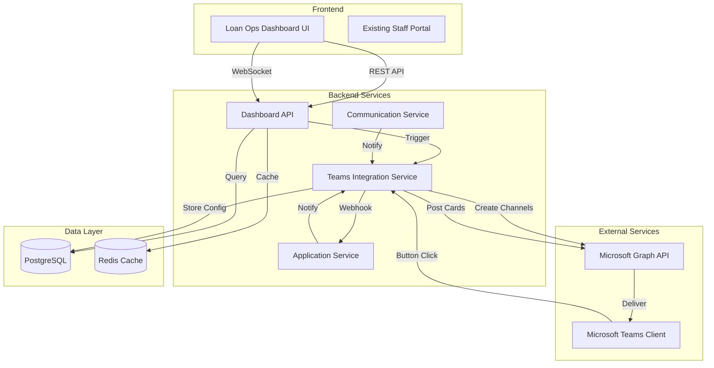

# Design Document

## Overview

The Loan Operations Dashboard and Teams Integration feature extends the existing Government Lending CRM with advanced operational capabilities. It provides loan officers with a real-time dashboard for managing application pipelines, work queues, and SLA compliance, while integrating with Microsoft Teams to enable collaborative decision-making through interactive Adaptive Cards.

The system consists of three main components:
1. **Loan Operations Dashboard UI** - React-based web interface with real-time updates
2. **Teams Integration Service** - Backend service managing Microsoft Graph API interactions
3. **Dashboard API Layer** - REST endpoints for dashboard data and quick actions

## Architecture

### High-Level Architecture



### Component Interaction Flow

**Dashboard Load Flow:**
1. User navigates to Loan Operations Dashboard
2. Dashboard UI requests pipeline data from Dashboard API
3. Dashboard API queries PostgreSQL with filters and pagination
4. Dashboard API checks Redis cache for statistics
5. Dashboard API returns aggregated data with SLA calculations
6. Dashboard UI renders pipeline view with color-coded badges

**Teams Notification Flow:**
1. Application event occurs (new submission, SLA warning, etc.)
2. Application Service emits event to Teams Integration Service
3. Teams Service checks teams_channels table for configuration
4. Teams Service constructs Adaptive Card with application data
5. Teams Service posts card to Teams channel via Microsoft Graph API
6. Teams client displays interactive card to team members

**Teams Action Flow:**
1. User clicks action button on Adaptive Card in Teams
2. Teams sends webhook request to Teams Integration Service
3. Teams Service validates request signature
4. Teams Service maps Teams user to system user and checks permissions
5. Teams Service calls Application Service to execute action
6. Teams Service updates Adaptive Card to show result
7. Teams Service logs action to audit log

## Components and Interfaces

### 1. Loan Operations Dashboard UI

**Technology:** React with TypeScript, Material-UI components

**Key Components:**

```typescript
// Main Dashboard Component
interface DashboardProps {
  userId: string;
  userRole: string;
}

interface PipelineView {
  status: ApplicationStatus;
  applications: ApplicationSummary[];
  count: number;
}

interface ApplicationSummary {
  id: string;
  applicantName: string;
  programType: string;
  status: ApplicationStatus;
  submittedAt: Date;
  slaDeadline: Date;
  slaStatus: 'ON_TRACK' | 'AT_RISK' | 'BREACHED';
  riskScore: number;
  fraudFlags: FraudFlag[];
  assignedTo?: string;
}

// Queue Management Component
interface QueueView {
  myQueue: ApplicationSummary[];
  unassigned: ApplicationSummary[];
  autoAssignmentEnabled: boolean;
}

// SLA Analytics Component
interface SLAAnalytics {
  breachedApplications: ApplicationSummary[];
  atRiskApplications: ApplicationSummary[];
  averageProcessingTime: Record<ApplicationStatus, number>;
  bottlenecks: BottleneckAnalysis[];
}

interface BottleneckAnalysis {
  stage: ApplicationStatus;
  averageTimeInStage: number;
  applicationCount: number;
  threshold: number;
}

// Quick Actions Component
interface QuickAction {
  type: 'REQUEST_DOCS' | 'ADD_NOTE' | 'START_HUDDLE' | 'LOG_DECISION';
  applicationId: string;
  execute: () => Promise<void>;
}
```

**Real-time Updates:**
- WebSocket connection for live pipeline updates
- Polling fallback every 30 seconds
- Optimistic UI updates for quick actions

### 2. Dashboard API Layer

**Endpoints:**

```typescript
// Pipeline View
GET /api/dashboard/pipeline
Query Parameters:
  - status?: ApplicationStatus[]
  - programType?: string
  - assignedTo?: string
Response: {
  pipelines: PipelineView[];
  totalCount: number;
  lastUpdated: Date;
}

// Queue Management
GET /api/dashboard/queue
Query Parameters:
  - view: 'my-queue' | 'unassigned'
  - page: number
  - limit: number
Response: {
  applications: ApplicationSummary[];
  totalCount: number;
  hasMore: boolean;
}

POST /api/dashboard/queue/claim
Body: {
  applicationId: string;
}
Response: {
  success: boolean;
  assignedTo: string;
}

// SLA Analytics
GET /api/dashboard/sla
Query Parameters:
  - startDate?: Date
  - endDate?: Date
Response: SLAAnalytics

// Quick Actions
POST /api/dashboard/actions/request-documents
Body: {
  applicationId: string;
  documentTypes: DocumentType[];
  message: string;
}

POST /api/dashboard/actions/add-note
Body: {
  applicationId: string;
  note: string;
  isInternal: boolean;
}

POST /api/dashboard/actions/start-huddle
Body: {
  applicationId: string;
  participants: string[];
}
Response: {
  meetingLink: string;
  teamsChannelLink: string;
}

// WebSocket Events
WS /api/dashboard/stream
Events:
  - application.updated
  - application.assigned
  - sla.warning
  - sla.breached
```

**Caching Strategy:**
- Pipeline statistics: Redis cache with 30-second TTL
- User queue: Redis cache with 60-second TTL
- SLA calculations: Computed on-demand, cached for 5 minutes
- Application summaries: Database query with indexed fields

### 3. Teams Integration Service

**Core Service Class:**

```typescript
class TeamsIntegrationService {
  private graphClient: Client;
  private webhookSecret: string;
  private dbPool: Pool;
  private redisClient: RedisClient;

  /**
   * Initialize Microsoft Graph client with OAuth credentials
   */
  async initialize(): Promise<void>;

  /**
   * Create or retrieve Teams channel for program type
   */
  async ensureChannel(programType: string): Promise<ChannelInfo>;

  /**
   * Post Adaptive Card to Teams channel
   */
  async postAdaptiveCard(
    channelId: string,
    card: AdaptiveCard,
    applicationId: string
  ): Promise<string>;

  /**
   * Handle webhook callback from Teams
   */
  async handleWebhook(
    request: WebhookRequest
  ): Promise<WebhookResponse>;

  /**
   * Update existing Adaptive Card with new status
   */
  async updateCard(
    messageId: string,
    updates: CardUpdate
  ): Promise<void>;

  /**
   * Create Teams meeting for application huddle
   */
  async createMeeting(
    applicationId: string,
    participants: string[]
  ): Promise<MeetingInfo>;
}
```

**Microsoft Graph API Integration:**

```typescript
// Authentication
interface GraphAuthConfig {
  clientId: string;
  clientSecret: string;
  tenantId: string;
  scopes: string[];
}

// Channel Management
interface ChannelInfo {
  teamId: string;
  channelId: string;
  channelName: string;
  webUrl: string;
}

// Adaptive Card Structure
interface AdaptiveCard {
  type: 'AdaptiveCard';
  version: '1.4';
  body: CardElement[];
  actions: CardAction[];
}

interface CardElement {
  type: 'TextBlock' | 'FactSet' | 'Container';
  text?: string;
  facts?: Fact[];
  items?: CardElement[];
}

interface CardAction {
  type: 'Action.Submit';
  title: string;
  data: {
    action: 'APPROVE' | 'REJECT' | 'REQUEST_INFO';
    applicationId: string;
  };
}

// Webhook Request
interface WebhookRequest {
  type: 'message';
  value: {
    action: string;
    applicationId: string;
  };
  from: {
    id: string;
    name: string;
    aadObjectId: string;
  };
  conversation: {
    id: string;
  };
  replyToId: string;
}
```

**Adaptive Card Templates:**

```typescript
// New Submission Card
function createSubmissionCard(application: Application): AdaptiveCard {
  return {
    type: 'AdaptiveCard',
    version: '1.4',
    body: [
      {
        type: 'TextBlock',
        text: '🆕 New Application Submitted',
        size: 'Large',
        weight: 'Bolder',
      },
      {
        type: 'FactSet',
        facts: [
          { title: 'Applicant', value: application.applicantName },
          { title: 'Program', value: application.programType },
          { title: 'Amount', value: `$${application.requestedAmount}` },
          { title: 'Submitted', value: formatDate(application.submittedAt) },
          { title: 'Risk Score', value: `${application.riskScore}/100` },
        ],
      },
    ],
    actions: [
      {
        type: 'Action.OpenUrl',
        title: 'View Application',
        url: `${config.appUrl}/applications/${application.id}`,
      },
      {
        type: 'Action.Submit',
        title: 'Claim',
        data: { action: 'CLAIM', applicationId: application.id },
      },
    ],
  };
}

// SLA Warning Card
function createSLAWarningCard(application: Application): AdaptiveCard {
  return {
    type: 'AdaptiveCard',
    version: '1.4',
    body: [
      {
        type: 'TextBlock',
        text: '[WARN] SLA Warning',
        size: 'Large',
        weight: 'Bolder',
        color: 'Warning',
      },
      {
        type: 'TextBlock',
        text: `Application ${application.id} is approaching SLA breach`,
      },
      {
        type: 'FactSet',
        facts: [
          { title: 'Applicant', value: application.applicantName },
          { title: 'Time Remaining', value: formatDuration(application.slaTimeRemaining) },
          { title: 'Current Stage', value: application.status },
        ],
      },
    ],
    actions: [
      {
        type: 'Action.OpenUrl',
        title: 'Review Now',
        url: `${config.appUrl}/applications/${application.id}`,
      },
    ],
  };
}

// Decision Ready Card
function createDecisionReadyCard(application: Application): AdaptiveCard {
  return {
    type: 'AdaptiveCard',
    version: '1.4',
    body: [
      {
        type: 'TextBlock',
        text: '[OK] Ready for Decision',
        size: 'Large',
        weight: 'Bolder',
        color: 'Good',
      },
      {
        type: 'FactSet',
        facts: [
          { title: 'Applicant', value: application.applicantName },
          { title: 'Eligibility Score', value: `${application.eligibilityScore}%` },
          { title: 'Risk Score', value: `${application.riskScore}/100` },
          { title: 'Fraud Flags', value: application.fraudFlags.length.toString() },
        ],
      },
    ],
    actions: [
      {
        type: 'Action.Submit',
        title: ' Approve',
        style: 'positive',
        data: { action: 'APPROVE', applicationId: application.id },
      },
      {
        type: 'Action.Submit',
        title: ' Reject',
        style: 'destructive',
        data: { action: 'REJECT', applicationId: application.id },
      },
      {
        type: 'Action.Submit',
        title: ' Request More Info',
        data: { action: 'REQUEST_INFO', applicationId: application.id },
      },
    ],
  };
}
```

### 4. Auto-Assignment Engine

**Assignment Rules:**

```typescript
interface AssignmentRule {
  id: string;
  priority: number;
  condition: AssignmentCondition;
  assignTo: AssignmentTarget;
}

interface AssignmentCondition {
  programTypes?: string[];
  amountRange?: { min: number; max: number };
  riskScoreRange?: { min: number; max: number };
  requiresSpecialization?: string[];
}

interface AssignmentTarget {
  type: 'USER' | 'ROUND_ROBIN' | 'LEAST_LOADED';
  userId?: string;
  userPool?: string[];
}

class AutoAssignmentEngine {
  /**
   * Evaluate assignment rules and assign application
   */
  async assignApplication(application: Application): Promise<string | null> {
    const rules = await this.loadAssignmentRules();
    
    for (const rule of rules.sort((a, b) => b.priority - a.priority)) {
      if (this.matchesCondition(application, rule.condition)) {
        return await this.executeAssignment(application, rule.assignTo);
      }
    }
    
    return null; // No matching rule, remains unassigned
  }

  /**
   * Get current workload for load balancing
   */
  private async getUserWorkload(userId: string): Promise<number> {
    const result = await this.dbPool.query(
      'SELECT COUNT(*) FROM applications WHERE assigned_to = $1 AND status NOT IN ($2, $3, $4)',
      [userId, 'APPROVED', 'REJECTED', 'WITHDRAWN']
    );
    return parseInt(result.rows[0].count);
  }

  /**
   * Round-robin assignment
   */
  private async roundRobinAssign(userPool: string[]): Promise<string> {
    const lastAssigned = await this.getLastAssignedUser(userPool);
    const currentIndex = userPool.indexOf(lastAssigned);
    const nextIndex = (currentIndex + 1) % userPool.length;
    return userPool[nextIndex];
  }

  /**
   * Least-loaded assignment
   */
  private async leastLoadedAssign(userPool: string[]): Promise<string> {
    const workloads = await Promise.all(
      userPool.map(async (userId) => ({
        userId,
        workload: await this.getUserWorkload(userId),
      }))
    );
    
    workloads.sort((a, b) => a.workload - b.workload);
    return workloads[0].userId;
  }
}
```

## Data Models

### Database Schema Extensions

```sql
-- Teams channel configuration
CREATE TABLE teams_channels (
  id UUID PRIMARY KEY DEFAULT gen_random_uuid(),
  program_type VARCHAR(100) NOT NULL UNIQUE,
  team_id VARCHAR(255) NOT NULL,
  channel_id VARCHAR(255) NOT NULL,
  channel_name VARCHAR(255) NOT NULL,
  notification_rules JSONB NOT NULL DEFAULT '{}',
  is_active BOOLEAN DEFAULT true,
  created_at TIMESTAMP DEFAULT CURRENT_TIMESTAMP,
  updated_at TIMESTAMP DEFAULT CURRENT_TIMESTAMP
);

-- Teams message tracking
CREATE TABLE teams_messages (
  id UUID PRIMARY KEY DEFAULT gen_random_uuid(),
  application_id UUID NOT NULL REFERENCES applications(id),
  message_id VARCHAR(255) NOT NULL,
  channel_id VARCHAR(255) NOT NULL,
  card_type VARCHAR(50) NOT NULL,
  posted_at TIMESTAMP DEFAULT CURRENT_TIMESTAMP,
  updated_at TIMESTAMP DEFAULT CURRENT_TIMESTAMP,
  FOREIGN KEY (application_id) REFERENCES applications(id) ON DELETE CASCADE
);

-- Assignment rules
CREATE TABLE assignment_rules (
  id UUID PRIMARY KEY DEFAULT gen_random_uuid(),
  name VARCHAR(255) NOT NULL,
  priority INTEGER NOT NULL DEFAULT 0,
  condition JSONB NOT NULL,
  assign_to JSONB NOT NULL,
  is_active BOOLEAN DEFAULT true,
  created_at TIMESTAMP DEFAULT CURRENT_TIMESTAMP,
  updated_at TIMESTAMP DEFAULT CURRENT_TIMESTAMP
);

-- Application assignments (extend applications table)
ALTER TABLE applications ADD COLUMN assigned_to UUID REFERENCES users(id);
ALTER TABLE applications ADD COLUMN assigned_at TIMESTAMP;
ALTER TABLE applications ADD COLUMN sla_deadline TIMESTAMP;

-- Indexes for dashboard performance
CREATE INDEX idx_applications_assigned_to ON applications(assigned_to) WHERE assigned_to IS NOT NULL;
CREATE INDEX idx_applications_status_submitted ON applications(status, submitted_at);
CREATE INDEX idx_applications_sla_deadline ON applications(sla_deadline) WHERE sla_deadline IS NOT NULL;
CREATE INDEX idx_applications_risk_score ON applications(risk_score) WHERE risk_score > 50;
```

### TypeScript Models

```typescript
// Teams Configuration
interface TeamsChannelConfig {
  id: string;
  programType: string;
  teamId: string;
  channelId: string;
  channelName: string;
  notificationRules: NotificationRules;
  isActive: boolean;
  createdAt: Date;
  updatedAt: Date;
}

interface NotificationRules {
  NEW_SUBMISSION: boolean;
  SLA_WARNING: boolean;
  DECISION_READY: boolean;
  DOCUMENTS_RECEIVED: boolean;
  FRAUD_DETECTED: boolean;
}

// Teams Message
interface TeamsMessage {
  id: string;
  applicationId: string;
  messageId: string;
  channelId: string;
  cardType: 'SUBMISSION' | 'SLA_WARNING' | 'DECISION_READY';
  postedAt: Date;
  updatedAt: Date;
}

// Assignment Rule
interface AssignmentRule {
  id: string;
  name: string;
  priority: number;
  condition: AssignmentCondition;
  assignTo: AssignmentTarget;
  isActive: boolean;
  createdAt: Date;
  updatedAt: Date;
}
```

## Error Handling

### Teams Integration Errors

```typescript
class TeamsIntegrationError extends Error {
  constructor(
    message: string,
    public code: string,
    public details?: any
  ) {
    super(message);
    this.name = 'TeamsIntegrationError';
  }
}

// Error codes
enum TeamsErrorCode {
  GRAPH_API_ERROR = 'GRAPH_API_ERROR',
  CHANNEL_NOT_FOUND = 'CHANNEL_NOT_FOUND',
  INVALID_WEBHOOK = 'INVALID_WEBHOOK',
  UNAUTHORIZED_ACTION = 'UNAUTHORIZED_ACTION',
  CARD_POST_FAILED = 'CARD_POST_FAILED',
}

// Error handling strategy
async function handleTeamsError(error: any, context: string): Promise<void> {
  logger.error(`Teams integration error in ${context}:`, error);
  
  // Retry logic for transient errors
  if (error.statusCode === 429 || error.statusCode >= 500) {
    await retryWithBackoff(() => /* retry operation */);
  }
  
  // Alert administrators for critical errors
  if (error.code === TeamsErrorCode.GRAPH_API_ERROR) {
    await alertService.notifyAdmins({
      severity: 'HIGH',
      message: `Teams integration failure: ${error.message}`,
      context,
    });
  }
  
  // Fallback: Log to audit and continue without Teams notification
  await auditLogService.log({
    actionType: 'TEAMS_INTEGRATION_ERROR',
    details: { error: error.message, context },
  });
}
```

### Dashboard API Errors

```typescript
// Graceful degradation for dashboard
async function loadDashboardData(userId: string): Promise<DashboardData> {
  try {
    const [pipeline, queue, sla] = await Promise.allSettled([
      loadPipelineView(),
      loadQueueView(userId),
      loadSLAAnalytics(),
    ]);
    
    return {
      pipeline: pipeline.status === 'fulfilled' ? pipeline.value : [],
      queue: queue.status === 'fulfilled' ? queue.value : { myQueue: [], unassigned: [] },
      sla: sla.status === 'fulfilled' ? sla.value : null,
      errors: [
        pipeline.status === 'rejected' ? 'Pipeline data unavailable' : null,
        queue.status === 'rejected' ? 'Queue data unavailable' : null,
        sla.status === 'rejected' ? 'SLA analytics unavailable' : null,
      ].filter(Boolean),
    };
  } catch (error) {
    logger.error('Dashboard data load error:', error);
    throw new Error('Dashboard temporarily unavailable');
  }
}
```

## Testing Strategy

### Unit Tests
- Teams Integration Service methods
- Adaptive Card generation functions
- Auto-assignment rule evaluation
- SLA calculation logic
- Dashboard data aggregation

### Integration Tests
- Microsoft Graph API interactions (with mocked responses)
- Webhook request handling and validation
- Dashboard API endpoints with database
- WebSocket connection and event delivery

### End-to-End Tests
- Complete dashboard workflow: load → filter → quick action
- Teams notification flow: event → card post → action → update
- Auto-assignment: new application → rule evaluation → assignment
- SLA monitoring: time progression → warning → breach

### Performance Tests
- Dashboard load time with 10,000 applications
- Concurrent webhook requests (100 simultaneous)
- WebSocket connection scalability (1,000 concurrent users)
- Teams API rate limit handling

## Security Considerations

1. **Webhook Validation**: Verify Microsoft Teams webhook signatures using shared secret
2. **User Mapping**: Securely map Teams AAD Object IDs to system user accounts
3. **Permission Checks**: Enforce RBAC for all Teams-initiated actions
4. **Data Encryption**: Encrypt Teams configuration data in database
5. **Rate Limiting**: Implement rate limits on webhook endpoints to prevent abuse
6. **Audit Logging**: Log all Teams actions with user identity and timestamp
7. **Token Management**: Securely store and rotate Microsoft Graph API tokens
8. **CORS Configuration**: Restrict dashboard API access to authorized origins

## Deployment Considerations

1. **Microsoft Graph API Setup**: Register application in Azure AD, configure permissions
2. **Environment Variables**: Add Teams client ID, secret, tenant ID to configuration
3. **Webhook URL**: Configure public webhook endpoint with HTTPS
4. **Redis Scaling**: Ensure Redis can handle dashboard caching load
5. **Database Indexes**: Create indexes before deploying to production
6. **WebSocket Infrastructure**: Configure load balancer for WebSocket sticky sessions
7. **Monitoring**: Set up alerts for Teams API errors and webhook failures
