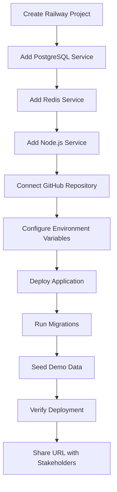
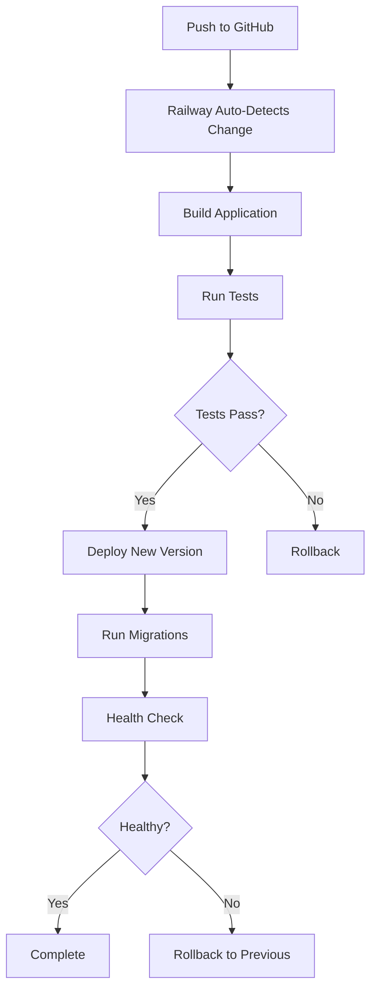

# MVP Deployment Design

## Overview

This document outlines the design for deploying the Government Lending CRM platform as an MVP to a cloud hosting platform. The deployment will use Railway.app as the primary platform due to its excellent support for Node.js, PostgreSQL, and Redis, along with straightforward deployment from GitHub.

## Architecture

### Deployment Platform: Railway.app

**Why Railway:**
- Native support for PostgreSQL and Redis
- Automatic HTTPS with custom domains
- GitHub integration for continuous deployment
- Environment variable management
- Reasonable free tier for MVP demos
- Simple pricing model

**Alternative Options:**
- Vercel (frontend-focused, requires separate backend)
- Render (good alternative, similar features)
- Fly.io (more complex setup)

### System Components

```
┌─────────────────────────────────────────────────────────┐
│                     Railway Platform                     │
├─────────────────────────────────────────────────────────┤
│                                                           │
│  ┌──────────────────┐  ┌──────────────────┐            │
│  │   Node.js API    │  │   PostgreSQL     │            │
│  │   (Express)      │──│   Database       │            │
│  │                  │  │                  │            │
│  │  - REST API      │  │  - Applications  │            │
│  │  - Static Files  │  │  - Documents     │            │
│  │  - WebSockets    │  │  - Users         │            │
│  └──────────────────┘  │  - AI Analysis   │            │
│           │             └──────────────────┘            │
│           │                                              │
│           │             ┌──────────────────┐            │
│           └─────────────│   Redis Cache    │            │
│                         │                  │            │
│                         │  - Sessions      │            │
│                         │  - Cache         │            │
│                         │  - Queue         │            │
│                         └──────────────────┘            │
│                                                           │
└─────────────────────────────────────────────────────────┘
                            │
                            │ HTTPS
                            ▼
                    ┌───────────────┐
                    │   End Users   │
                    │               │
                    │  - Applicants │
                    │  - Staff      │
                    │  - Admins     │
                    └───────────────┘
```

## Components and Interfaces

### 1. Application Server (Node.js/Express)

**Configuration:**
- Runtime: Node.js 20.x
- Build Command: `npm run build`
- Start Command: `npm start`
- Port: 3000 (Railway auto-assigns public port)

**Responsibilities:**
- Serve REST API endpoints
- Serve static HTML/CSS/JS files
- Handle WebSocket connections
- Process background jobs
- Run database migrations on startup

### 2. PostgreSQL Database

**Configuration:**
- Version: PostgreSQL 15+
- Connection: Via Railway's internal network
- Pooling: Configured in application (max 10 connections)

**Schema:**
- All tables from existing migrations
- Seeded with demo data on first deployment

### 3. Redis Cache

**Configuration:**
- Version: Redis 7+
- Connection: Via Railway's internal network
- Persistence: RDB snapshots

**Usage:**
- Session storage
- API response caching
- Rate limiting
- WebSocket pub/sub

### 4. Static Asset Serving

**Strategy:**
- Serve from Express static middleware
- Set cache headers for CSS/JS/images
- No separate CDN for MVP (can add later)

**Files:**
- HTML pages (applicant-portal.html, staff-portal.html, etc.)
- CSS files (design system, components)
- JavaScript files (UI components, API clients)
- Demo documents and images

## Data Models

### Environment Variables

```typescript
interface DeploymentConfig {
  // Server
  NODE_ENV: 'production';
  PORT: string; // Railway provides this
  API_VERSION: 'v1';
  
  // Database (Railway provides these)
  DATABASE_URL: string;
  DB_HOST: string;
  DB_PORT: string;
  DB_NAME: string;
  DB_USER: string;
  DB_PASSWORD: string;
  
  // Redis (Railway provides these)
  REDIS_URL: string;
  REDIS_HOST: string;
  REDIS_PORT: string;
  REDIS_PASSWORD: string;
  
  // Security
  JWT_SECRET: string; // Generate secure random string
  ENCRYPTION_KEY: string; // Generate secure random string
  
  // Demo Mode
  DEMO_MODE_ENABLED: 'true';
  USE_MOCK_SERVICES: 'true';
  
  // External Services
  USE_MOCK_EIN_VERIFICATION: 'true'; // Mock for MVP
  USE_MOCK_EMAIL: 'true'; // Mock for MVP
  
  // Real AI Services
  LLM_PROVIDER: 'openai' | 'claude';
  OPENAI_API_KEY: string; // Your actual key
  CLAUDE_API_KEY: string; // Your actual key
  
  // Azure Document Intelligence (optional)
  AZURE_DOCUMENT_INTELLIGENCE_ENDPOINT: string;
  AZURE_DOCUMENT_INTELLIGENCE_KEY: string;
  
  // CORS
  CORS_ORIGIN: string; // Railway deployment URL
}
```

### Demo Data Structure

```typescript
interface DemoDataSeed {
  users: {
    applicant: { username: 'demo-applicant', password: 'Demo123!' };
    staff: { username: 'demo-staff', password: 'Demo123!' };
    admin: { username: 'demo-admin', password: 'Demo123!' };
  };
  
  applications: Array<{
    status: ApplicationStatus;
    programType: ProgramType;
    eligibilityScore: number;
    documents: Document[];
    aiAnalysis: AIAnalysis;
  }>;
  
  documents: Array<{
    type: DocumentType;
    fileName: string;
    mockContent: string;
    qualityScore: number;
  }>;
}
```

## Error Handling

### Deployment Failures

1. **Build Failures:**
   - TypeScript compilation errors → Fix in code, redeploy
   - Missing dependencies → Update package.json
   - Out of memory → Increase Railway plan

2. **Runtime Failures:**
   - Database connection errors → Check DATABASE_URL
   - Redis connection errors → Check REDIS_URL
   - Port binding errors → Railway handles automatically

3. **Migration Failures:**
   - Schema conflicts → Reset database, run migrations
   - Seed data errors → Check seed scripts

### Application Errors

1. **Service Fallbacks:**
   - If AI service fails → Return error with retry option
   - If email service fails → Log to console (already mocked)
   - If external API fails → Return cached data or graceful error

2. **Database Errors:**
   - Connection pool exhausted → Implement retry logic
   - Query timeouts → Optimize queries, add indexes

3. **User-Facing Errors:**
   - 404 errors → Serve custom error page
   - 500 errors → Log and show generic message
   - API errors → Return structured JSON error

## Testing Strategy

### Pre-Deployment Testing

1. **Local Testing:**
   - Run `npm run build` to verify compilation
   - Test with production environment variables
   - Verify all migrations run successfully
   - Test seed data generation

2. **Integration Testing:**
   - Test database connections
   - Test Redis connections
   - Test API endpoints
   - Test static file serving

### Post-Deployment Testing

1. **Smoke Tests:**
   - Health check endpoint responds
   - Homepage loads
   - Login works for all user types
   - API endpoints respond correctly

2. **Feature Testing:**
   - Applicant can submit application
   - Staff can review applications
   - Admin can view dashboard
   - Demo mode displays correctly

3. **Performance Testing:**
   - Page load times < 3 seconds
   - API response times < 500ms
   - Database queries optimized
   - No memory leaks

## Deployment Workflow

### Initial Deployment



### Update Deployment



## Monitoring and Maintenance

### Health Checks

```typescript
interface HealthCheckResponse {
  status: 'healthy' | 'degraded' | 'unhealthy';
  timestamp: string;
  services: {
    database: { status: string; latency: number };
    redis: { status: string; latency: number };
    api: { status: string; uptime: number };
  };
  version: string;
}
```

### Logging Strategy

1. **Application Logs:**
   - Info: Startup, shutdown, major operations
   - Warn: Fallback to mock services, retries
   - Error: Exceptions, failed operations

2. **Access Logs:**
   - HTTP requests (method, path, status, duration)
   - API endpoint usage
   - Error rates

3. **Performance Logs:**
   - Database query times
   - Redis operation times
   - API response times

### Metrics to Track

- Request rate (requests/minute)
- Error rate (errors/total requests)
- Response time (p50, p95, p99)
- Database connection pool usage
- Redis memory usage
- Active WebSocket connections

## Security Considerations

### Production Security

1. **Environment Variables:**
   - Never commit secrets to Git
   - Use Railway's environment variable management
   - Rotate JWT_SECRET and ENCRYPTION_KEY regularly

2. **HTTPS:**
   - Railway provides automatic HTTPS
   - Redirect HTTP to HTTPS
   - Set secure cookie flags

3. **Rate Limiting:**
   - Limit API requests per IP
   - Limit login attempts
   - Limit file uploads

4. **Input Validation:**
   - Validate all user inputs
   - Sanitize file uploads
   - Prevent SQL injection

### Demo Mode Security

1. **Data Isolation:**
   - Demo data clearly marked
   - Separate from production data
   - Can be reset easily

2. **Access Control:**
   - Demo users have limited permissions
   - Cannot access real user data
   - Cannot perform destructive operations

## Cost Estimation

### Railway Pricing (Estimated)

- **Hobby Plan:** $5/month
  - Includes: 512MB RAM, shared CPU
  - PostgreSQL: Included
  - Redis: Included
  - Bandwidth: 100GB/month

- **Pro Plan:** $20/month (if needed)
  - Includes: 8GB RAM, dedicated CPU
  - Better performance for demos

### Alternative Platforms

- **Render:** $7/month (Starter)
- **Fly.io:** ~$10/month (estimated)
- **Vercel + Supabase:** $0 (free tier, limited)

## Rollback Strategy

### Automatic Rollback

Railway supports instant rollback to previous deployments:
1. Go to Railway dashboard
2. Select deployment history
3. Click "Rollback" on previous version

### Manual Rollback

If needed, can redeploy from specific Git commit:
1. Revert Git commit
2. Push to GitHub
3. Railway auto-deploys

### Database Rollback

For schema changes:
1. Keep migration rollback scripts
2. Run down migrations if needed
3. Restore from backup if critical

## Documentation for Stakeholders

### Demo Access Guide

```markdown
# Government Lending CRM - MVP Demo

## Access Information

**Application URL:** https://your-app.railway.app

### Demo Accounts

**Applicant Portal:**
- Username: `demo-applicant`
- Password: `Demo123!`

**Staff Portal:**
- Username: `demo-staff`
- Password: `Demo123!`

**Admin Dashboard:**
- Username: `demo-admin`
- Password: `Demo123!`

## Key Features to Explore

1. **Applicant Portal:**
   - Submit new application
   - Upload documents with AI quality feedback
   - Track application status

2. **Staff Portal:**
   - Review application queue
   - View AI analysis results
   - Manage anomaly alerts
   - Make decisions with AI assistance

3. **Admin Dashboard:**
   - View AI performance metrics
   - Monitor anomaly detection
   - Manage demo mode
   - View system analytics

## Demo Mode

This deployment runs in demo mode with simulated data. All AI features use mock responses to demonstrate functionality without requiring external API subscriptions.
```

## Future Enhancements

### Phase 2 Improvements

1. **CDN Integration:**
   - Use Cloudflare or CloudFront for static assets
   - Improve global performance

2. **Real AI Services:**
   - Integrate actual OpenAI API
   - Connect Azure Document Intelligence
   - Enable real document analysis

3. **Monitoring:**
   - Add Sentry for error tracking
   - Add LogRocket for session replay
   - Add DataDog for APM

4. **Scaling:**
   - Add load balancer
   - Implement horizontal scaling
   - Add read replicas for database

5. **CI/CD:**
   - Add automated tests in pipeline
   - Add staging environment
   - Add blue-green deployments
